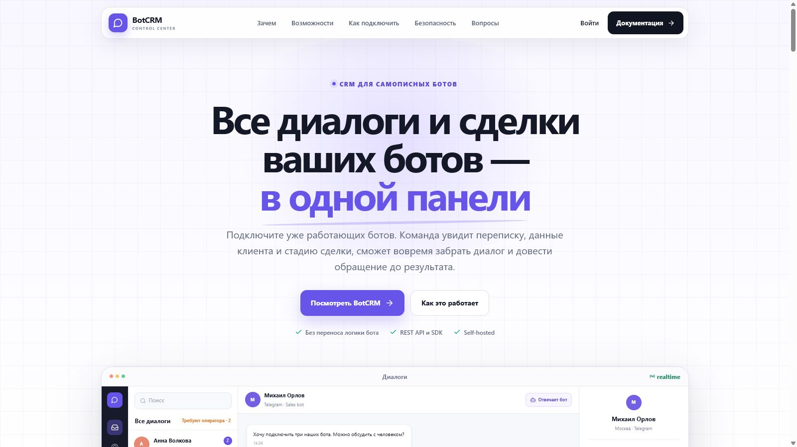
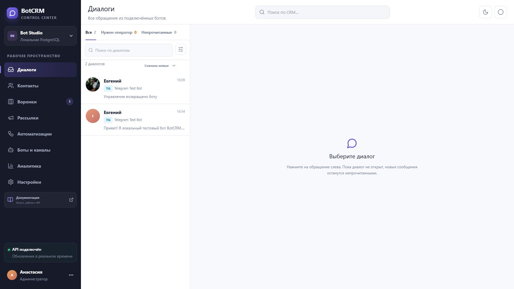
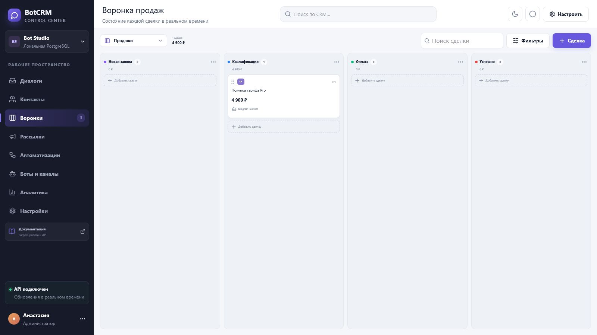
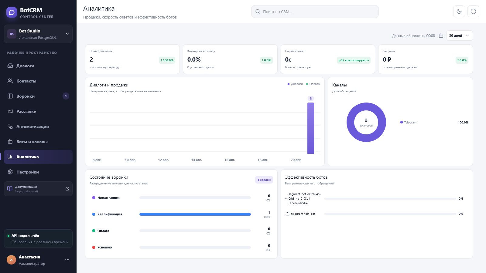
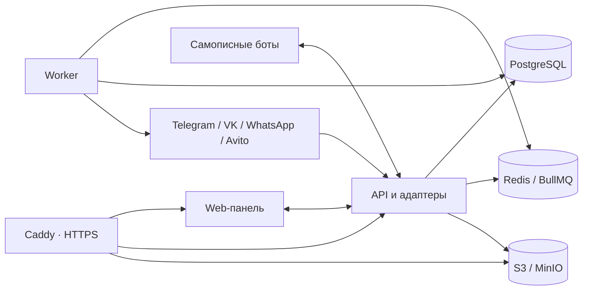

<div align="center">
  

  # BotCRM

  **Self-hosted CRM и единый центр управления для самописных ботов**

  Диалоги · контакты · переменные · перехват оператором · воронки · рассылки · автоматизации · аналитика

  <p>
    <a href="https://github.com/Evgenykravchenko/botcrm/actions/workflows/ci.yml"></a>
    <a href="LICENSE"></a>
    
    
    
    
  </p>

  [Возможности](#возможности) · [Быстрый запуск](#production-за-5-шагов) · [Интеграция бота](#подключение-самописного-бота) · [Документация](#документация) · [Участие](#участие-и-безопасность)
</div>



## Зачем нужен BotCRM

BotCRM добавляет к уже работающим ботам операционный слой: команда видит обращения и данные клиента, может забрать диалог у бота, вести сделку по воронке, запускать сегментированные рассылки и автоматизировать CRM-действия. Переписывать сценарии бота внутри закрытого конструктора не требуется.

| Без BotCRM | С BotCRM |
|---|---|
| История разбросана по ботам и логам | Все обращения находятся в едином inbox |
| Переменные видны только разработчику | Типизированные поля доступны оператору и фильтрам |
| Бот и человек могут ответить одновременно | Состояния `BOT / HUMAN / PAUSED` явно управляют диалогом |
| Продажи ведутся в отдельной таблице | Сделка связана с контактом и перепиской |
| Рассылки запускаются отдельными скриптами | Сегменты, предпросмотр, очередь, лимиты и результаты находятся в панели |

## Интерфейс

<table>
  <tr>
    <td width="50%"></td>
    <td width="50%"></td>
  </tr>
  <tr>
    <td align="center"><b>Единый inbox</b><br/>Realtime, фильтры, непрочитанные, аватары и перехват оператором</td>
    <td align="center"><b>Воронки</b><br/>Свои этапы, drag-and-drop, сумма и история сделки</td>
  </tr>
</table>



## Возможности

- **Диалоги.** Единая переписка всех подключённых ботов, вложения, поиск, статусы доставки, заметки, задачи и назначение ответственного.
- **Контакты.** Несколько каналов у одного человека, теги, телефон, email, город и произвольные типизированные переменные.
- **Управление ботом.** Атомарный перехват разговора оператором и возврат управления совместимому боту.
- **Воронки.** Неограниченные воронки и стадии, ручное перемещение сделок и автоматические переходы.
- **Рассылки.** Динамические сегменты, шаблонные переменные, изображения, кнопки, расписание, часовые пояса и результаты получателей.
- **Автоматизации.** Событие → условия → действия: поля, теги, задачи, стадии, оператор, сообщение или подписанный webhook.
- **Каналы.** Telegram, VK, WhatsApp Cloud API, Avito Messenger API и универсальный REST/Mirror SDK.
- **Аналитика.** Обращения, конверсия, выручка, каналы, состояние воронки и эффективность ботов.
- **Команда и безопасность.** RBAC, Argon2id, TOTP-MFA, управление сессиями, сервисные токены, аудит и rate limiting.
- **Эксплуатация.** PostgreSQL, Redis/BullMQ, S3/MinIO, realtime, миграции, зашифрованные backup и Prometheus/Grafana.

## Архитектура



Репозиторий остаётся модульным монолитом: web, API и worker собираются из одного monorepo, но запускаются отдельными процессами и могут масштабироваться независимо.

## Production за 5 шагов

### 1. Подготовьте сервер

Рекомендуется Ubuntu 24.04 или Debian 12, минимум 2 vCPU, 4 ГБ RAM, 40 ГБ SSD. Установите Git, Node.js 22+ и Docker Engine с Compose plugin.

### 2. Настройте DNS

Создайте две A-записи на IP сервера:

```text
crm.example.ru        → 203.0.113.10
media.crm.example.ru  → 203.0.113.10
```

Откройте входящие TCP-порты `80` и `443`, а также UDP `443` для HTTP/3. PostgreSQL, Redis и MinIO наружу не публикуются.

### 3. Создайте production-конфигурацию

```bash
git clone https://github.com/Evgenykravchenko/botcrm.git botcrm
cd botcrm
npm ci
npm run prod:init -- --domain crm.example.ru --email owner@example.ru --timezone Europe/Moscow
```

Команда создаст `.env.production`, сгенерирует независимые случайные секреты и один раз покажет пароль первого владельца. Сохраните пароль в менеджере паролей.

### 4. Проверьте и запустите

```bash
npm run prod:check
npm run prod:up
npm run prod:ps
```

Caddy автоматически выпустит TLS-сертификаты после того, как DNS начнёт указывать на сервер.

### 5. Откройте систему

- панель: `https://crm.example.ru`;
- пользовательская документация: `https://crm.example.ru/docs`;
- Swagger/OpenAPI: `https://crm.example.ru/api-docs`;
- health-check: `https://crm.example.ru/api/v1/health`.

После запуска выполните внешнюю проверку:

```bash
npm run prod:check:live
```

Полная инструкция с firewall, обновлениями, backup, восстановлением и диагностикой: **[Production deployment](docs/PRODUCTION.md)**.

### Вариант без публичного IP: Tailscale Funnel

В репозитории есть отдельный Compose-профиль, который создаёт для BotCRM собственный Tailscale-узел. Панель/API публикуются на `443`, медиа — на `8443`; внутренние PostgreSQL, Redis и MinIO остаются только в сети `botcrm_backend`.

```bash
npm run prod:init -- \
  --domain botcrm-rpi.example-tailnet.ts.net \
  --storage-domain botcrm-rpi.example-tailnet.ts.net:8443 \
  --email owner@example.ru \
  --timezone Europe/Moscow

TAILSCALE_HOSTNAME=botcrm-rpi npm run prod:tailscale:config
TAILSCALE_HOSTNAME=botcrm-rpi npm run prod:tailscale:up
```

При первом запуске откройте URL авторизации из `docker compose logs tailscale`. После входа состояние сохраняется в отдельном Docker volume, а входящие порты роутера открывать не требуется. Подробности и проверка запуска описаны в [production-инструкции](docs/PRODUCTION.md#tailscale-funnel-без-публичного-ip).

## Подключение самописного бота

BotCRM поддерживает два режима.

### Mirror / SDK

Существующий бот сохраняет webhook или long polling, передаёт копии событий в BotCRM и отправляет ответы через API платформы. Это минимально инвазивный способ подключения.

```ts
import { BotCrmClient } from "@botcrm/sdk";

const crm = new BotCrmClient({
  baseUrl: "https://crm.example.ru",
  workspaceId: "ws_demo",
  botId: "sales_bot",
  serviceToken: process.env.BOTCRM_TOKEN!,
});

const result = await crm.incoming({
  eventId: "telegram:" + update.update_id,
  channel: "telegram",
  chatId: String(update.message.chat.id),
  userId: String(update.message.from.id),
  text: update.message.text,
  profile: { name: update.message.from.first_name },
  attributes: { lead_score: 80, source: "telegram" },
});

if (result.deliverToBot) {
  await crm.send({
    conversationId: result.conversationId!,
    text: "Сообщение принято",
    idempotencyKey: crypto.randomUUID(),
  });
}
```

### Gateway

BotCRM владеет webhook канала, проверяет подпись, устраняет дубликаты, сохраняет событие и передаёт его endpoint вашего бота только тогда, когда диалог находится в состоянии `BOT`.

```text
POST https://crm.example.ru/api/v1/webhooks/{channel}/{connectorId}
```

Подробный контракт событий, HMAC-подписи и примеры TypeScript/Python находятся в [руководстве разработчика](docs/DEVELOPER_GUIDE.md).

## Локальная разработка

Требуются Node.js 22+, npm и Docker Desktop.

```powershell
Copy-Item .env.example .env
npm ci
npm run infra:up
npm run api:dev
npm run worker:dev
npm run dev
```

Процессы запускаются в трёх терминалах. Панель доступна на `http://localhost:3001`, API — на `http://localhost:4100`.

Проверки:

```bash
npm run test:all
npm run lint
npm audit --omit=dev --audit-level=high
```

## Эксплуатация

```bash
# Логи
npm run prod:logs

# Зашифрованная резервная копия PostgreSQL и MinIO
BOTCRM_BACKUP_PASSWORD='отдельный-длинный-пароль' npm run prod:backup

# Опциональные Prometheus и Grafana, доступные только через localhost сервера
npm run prod:up:observability

# Миграции вручную
npm run prod:migrate
```

Обновление выполняется только после backup:

```bash
git pull --ff-only
BOTCRM_BACKUP_PASSWORD='отдельный-длинный-пароль' npm run prod:backup
npm run prod:up
npm run prod:check:live
```

## Структура репозитория

```text
app/                 web-панель, landing и web-документация
services/api/        REST API, авторизация, адаптеры и realtime
services/worker/     очереди, доставки, повторы и retention
packages/sdk-ts/     TypeScript SDK
sdks/python/         Python SDK
infra/               Docker, Caddy, миграции, backup и monitoring
docs/                инструкции пользователя, разработчика и администратора
examples/             тестовый Telegram-бот
.github/workflows/   Linux CI: сборки, тесты и production Docker-образы
```

## Документация

- [Production-развёртывание](docs/PRODUCTION.md)
- [Запуск и эксплуатация](docs/STARTUP.md)
- [Руководство пользователя](docs/USER_GUIDE.md)
- [Интеграция для разработчика](docs/DEVELOPER_GUIDE.md)
- Интерактивная документация после запуска: `/docs`
- Swagger/OpenAPI после запуска: `/api-docs`

## Важные ограничения

- «Любой бот» должен передавать события через Gateway либо быть дополнен REST/SDK-интеграцией.
- В Mirror-режиме прямые отправки старого бота в канал нельзя технически остановить; бот должен учитывать `deliverToBot` и отправлять сообщения через BotCRM.
- WhatsApp и Avito работают только при наличии официального доступа и соблюдении правил соответствующих платформ.
- Юридические требования к персональным данным, согласию и рекламным рассылкам зависят от юрисдикции владельца установки.
## Участие и безопасность

Проект открыт для bug reports, предложений и pull requests. Перед изменениями прочитайте [CONTRIBUTING.md](CONTRIBUTING.md) и [правила сообщества](CODE_OF_CONDUCT.md).

Уязвимости нельзя публиковать в обычных issues. Используйте GitHub Private Vulnerability Reporting по инструкции из [SECURITY.md](SECURITY.md). Никогда не прикладывайте `.env`, токены, cookies, production-логи, резервные копии и данные клиентов.

Контакты, телефоны, email и переписки в seed, тестах и скриншотах являются демонстрационными. Не используйте production-данные при создании issue или pull request.

История пользовательских изменений ведётся в [CHANGELOG.md](CHANGELOG.md).

## Лицензия

BotCRM распространяется на условиях [GNU Affero General Public License v3.0](LICENSE) (`AGPL-3.0-only`). Вы можете использовать, изучать и изменять проект. При предоставлении пользователям доступа по сети к модифицированной версии необходимо предоставить им соответствующий исходный код этой версии на условиях AGPL-3.0.

Copyright © 2026 Evgeny Kravchenko. Программное обеспечение предоставляется без гарантий.
